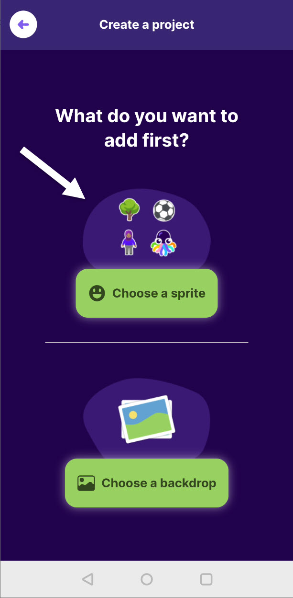
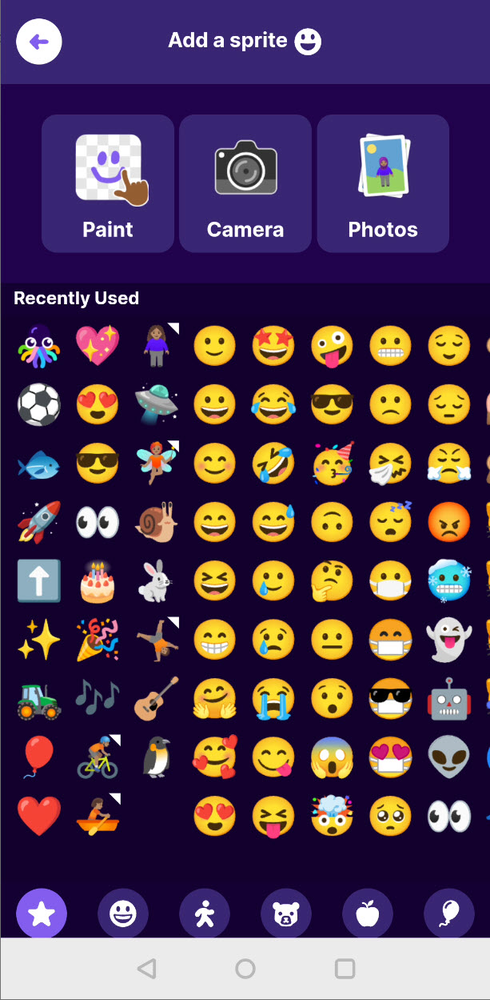
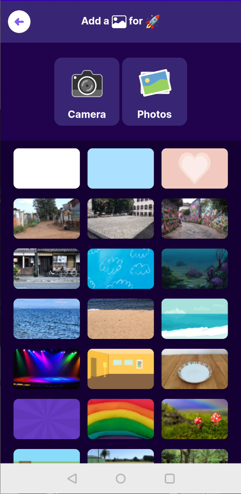

# 1 Das OctoStudio

Das OctoStudio ist eine App für Android und macOS, die als Weiterentwicklung der beliebten grafischen Programmierlernumgebung [Scratch](https://scratch.mit.edu/) für mobile Endgeräte ins Leben gerufen wurde. In diesem Kurs nutzen wir das OctoStudio zum Kennenlernen der wichtigsten Konzepte in der Programmierung.

Klickt auf den folgenden Link, um zur offiziellen Webseite der App zu gelangen.


Offizielle Webseite der OctoStudio-App.


## Der Startbildschirm

Installiert die OctoStudio-App auf eurem Smartphone oder Tablet und startet sie. Ihr solltet den Startbildschirm der App angezeigt bekommen. Auf dem Startbildschirm wird euch direkt ein großer grüner Button zum Erstellen eines neuen Projekts angezeigt. Um sich erst einmal inspirieren zu lassen, gibt es unter "Explore" einen Bereich, in dem Beispielprojekte und ein kurzes Übersichtsvideo zu sehen sind. Die Beispielprojekte können als Startpunkt für die eigene Idee dienen und auf Klick kopiert werden.

<figure><figcaption>
Startbildschirm der OctoStudio-App.
</figcaption></figure>

 

<figure><figcaption>
Beispielprojekt findet man unter "Explore".
</figcaption></figure>

## Ein leeres Projekt erstellen

Wir beginnen in diesem Kurs mit einem leeren Projekt. Klickt dazu auf den grünen Button "Create new project" und bekommt zwei Optionen, euer Projekt zu beginnen:

1. Ihr fügt eurem Projekt zuerst ein sogenanntes "Sprite" hinzu.
2. Ihr fügt eurem Projekt zuerst einen sogenannten "Backdrop" oder Hintergrundbild hinzu.

Es ist egal, womit wir beginnen, da wir am Ende beides benötigen. Wir gehen in der Reihenfolge vor, wie sie vom OctoStudio empfohlen wird und beginnen mit der Auswahl eines Sprites.

<figure><figcaption>
Was soll zuerst ausgewählt werden?
</figcaption></figure>

 

<figure><figcaption>
Auswahlbildschirm eines "Sprites".
</figcaption></figure>

## Was ist ein Sprite?

Der Begriff Sprite bedeutet übersetzt nach Wörterbuch "Elfe", "Kobold" oder "Wicht". Im Kontext eines Computerspiels ist damit aber ein kleines Bild gemeint, das im Kontext des Spiels über den Bildschirm bewegt wird. Das kann etwa die Spielfigur sein, die man im Spiel steuert. Es können aber auch gegnerische Figuren wie Monster sein. Im Prinzip jedes bewegliche Element, dass uns in einem Spiel begegnet.&#x20;

Charakteristisch für ein Sprite ist, dass es sich um ein kleines, rechteckiges Bild bestehend aus einer Anzahl (farbiger) Pixel handelt. Man nennt das auch eine Bitmap. Gute Beispiele für Sprites sind Emojis, die deshalb im Auswahlbildschirm des OctoStudio an erster Stelle zu sehen sind. Neben Emojis können wir unser Sprite auch aus einem Bild importieren, das auf unserem Smartphone oder Tablet gespeichert ist, oder das wir mit der Kamera aufnehmen. Als dritte Option können wir mit den Fingern auf unserem Bildschirm eine kleine Zeichnung erstellen.

<figure><figcaption>
Auswahlbildschirm eines "Backdrops" für das gewählte Sprite 🚀.
</figcaption></figure>
 

