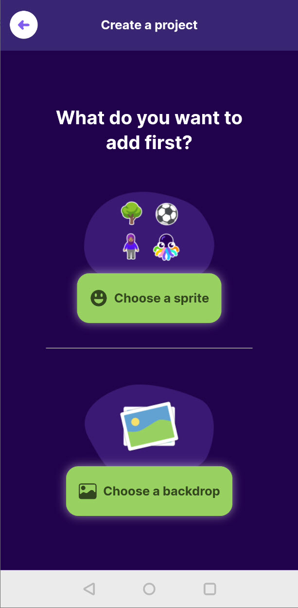

# 1 Das OctoStudio

Das OctoStudio ist eine App für Android und macOS, die als Weiterentwicklung der beliebten grafischen Programmierlernumgebung [Scratch](https://scratch.mit.edu/) ins Leben gerufen wurde. Klickt auf den folgenden Link, um zur offiziellen Webseite der App zu gelangen.


Offizielle Webseite der OctoStudio-App.


## Der Startbildschirm

Installiert die OctoStudio-App auf eurem Smartphone oder Tablet und startet sie. Ihr solltet den Startbildschirm der App angezeigt bekommen. Auf dem Startbildschirm wird euch direkt ein großer grüner Button zum Erstellen eines neuen Projekts angezeigt. Um sich erst einmal inspirieren zu lassen, gibt es unter "Explore" einen Bereich, in dem Beispielprojekte und ein kurzes Übersichtsvideo zu sehen sind. Die Beispielprojekte können als Startpunkt für die eigene Idee dienen und auf Klick kopiert werden.

<figure><figcaption>
Startbildschirm der OctoStudio-App.
</figcaption></figure>

 

<figure><figcaption>
Beispielprojekt findet man unter "Explore".
</figcaption></figure>

## Ein leeres Projekt erstellen

Wir beginnen in diesem Kurs mit einem leeren Projekt. Klickt daher auf den grünen Button "Create new project" und ihr gelangt zur Auswahl, womit ihr beginnen wollt. Es gibt zwei Optionen, ein Projekt zu beginnen:

1. Ihr fügt zuerst ein sogenannte "Sprite" hinzu.
2. Ihr fügt zuerst einen sogenannten "Backdrop" oder Hintergrund hinzu.

Es ist egal, womit wir beginnen, da wir am Ende beides benötigen.

<figure><figcaption>
Was soll zuerst ausgewählt werden?
</figcaption></figure>
