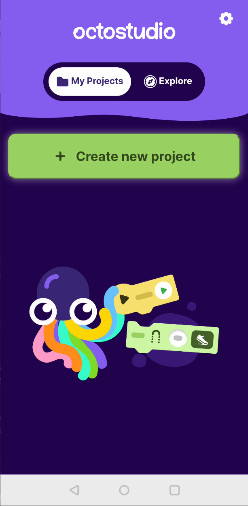
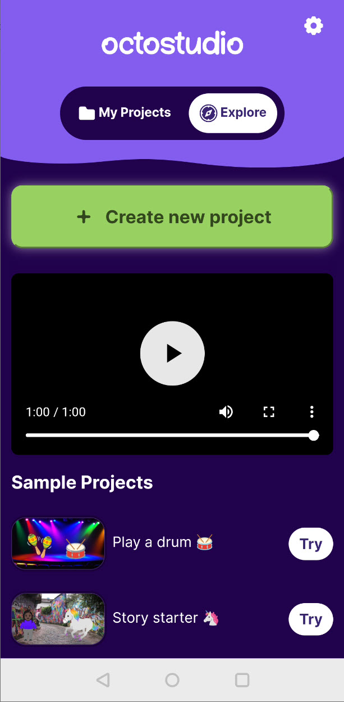

# 1 Das OctoStudio

Das OctoStudio ist eine App für Android und macOS, die als Weiterentwicklung der beliebten grafischen Programmierlernumgebung [Scratch](https://scratch.mit.edu/) ins Leben gerufen wurde.  Klickt auf den folgenden Link, um zur offiziellen Webseite der App zu gelangen.


Offizielle Webseite der OctoStudio-App.


Installiert die App auf eurem Smartphone oder Tablet und startet sie. Ihr solltet den Startbildschirm der App angezeigt bekommen. Auf dem Startbildschirm wird euch direkt ein großer grüner Button zum Erstellen eines neuen Projekts angezeigt. Um sich erst einmal inspirieren zu lassen, gibt es unter "Explore" einen Bereich, in dem Beispielprojekte und ein kurzes Übersichtsvideo zu sehen sind. Die Beispielprojekte können als Startpunkt für die eigene Idee dienen und auf Klick kopiert werden.

<figure><figcaption>
Startbildschirm der OctoStudio-App.
</figcaption></figure>
 
<figure><figcaption>
Beispielprojekt findet man unter "Explore".
</figcaption></figure>

