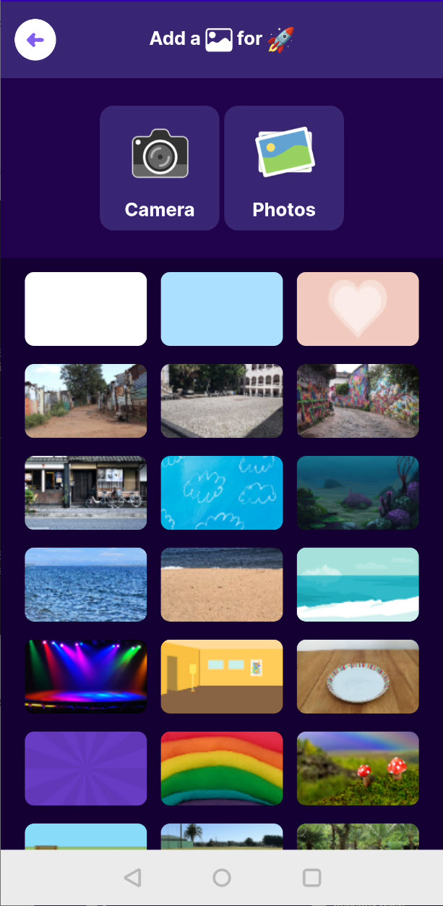

# Sprites und Backdrops

## Was ist ein Sprite?

Der Begriff Sprite bedeutet übersetzt nach Wörterbuch "Elfe", "Kobold" oder "Wicht". Im Kontext eines Computerspiels ist damit aber ein kleines Bild gemeint, das im Kontext des Spiels über den Bildschirm bewegt wird. Das kann etwa die Spielfigur sein, die man im Spiel steuert. Es können aber auch gegnerische Figuren wie Monster sein. Im Prinzip jedes bewegliche Element, dass uns in einem Spiel begegnet.

Charakteristisch für ein Sprite ist, dass es sich um ein kleines, rechteckiges Bild bestehend aus einer Anzahl (farbiger) Pixel handelt. Man nennt das auch eine Bitmap. Gute Beispiele für Sprites sind Emojis, die deshalb im Auswahlbildschirm des OctoStudio an erster Stelle zu sehen sind. Neben Emojis können wir unser Sprite auch aus einem Bild importieren, das auf unserem Smartphone oder Tablet gespeichert ist, oder das wir mit der Kamera aufnehmen. Als dritte Option können wir mit den Fingern auf unserem Bildschirm eine kleine Zeichnung erstellen.

Für unser Projekt in diesem Kurs benötigen wir als Erstes unser kleines Raumschiff, das wir mit dem Raketen-Emoji 🚀 umsetzen können. Wählt dieses Emoji aus der Liste aus.

## Was ist ein Backdrop?

Nach der Auswahl des Sprites gelangt ihr automatisch zur Maske, in der ihr einen Hintergrund für euer erste Szene des Spiels auswählen könnt. Der Begriff in der Spieleentwicklung für den Hintergrund einer Szene ist _Backdrop_.

<figure><figcaption>
Auswahlbildschirm eines "Backdrops" für das gewählte Sprite 🚀.
</figcaption></figure>

Im OctoStudio wird uns eine Reihe an Hintergründen zur Auswahl angeboten. Wir haben auch die Möglichkeit, eigene Hintergründe aus einem Foto auszuwählen oder über die Kamera aufzunehmen. Für unser Projekt wählen wir den Weltraum-Hintergrund, den ihr findet, wenn ihr mit dem Finger weiter nach unten scrollt. Sobald ihr auf das Bild mit der Galaxie klickt, werdet ihr zum Editor weitergeleitet. Hier findet ab nun die weitere Entwicklung unseres Spiels statt.

<figure><figcaption>
Nach der Auswahl des Sprites und Hintergrunds landen wir im Editor.
</figcaption></figure>
